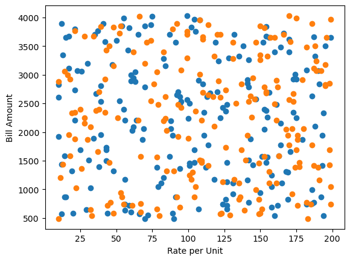
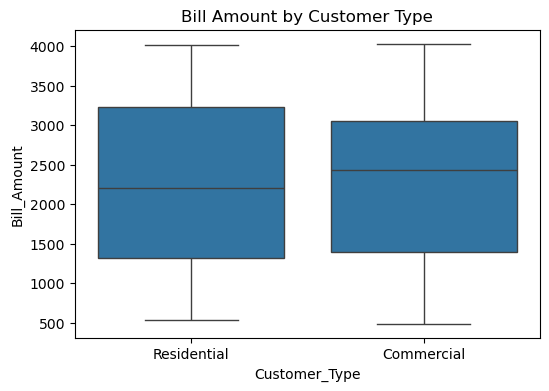
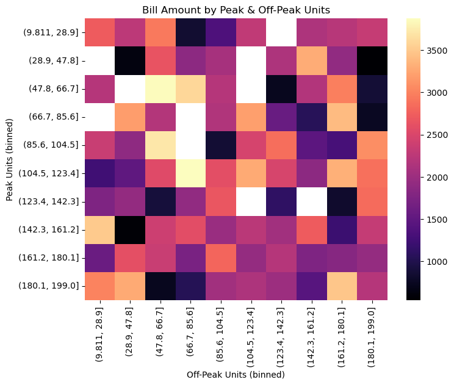

# 🔌 Electricity Bill Prediction using Linear Regression

## 📌 Overview
This project predicts household electricity bills using **Linear Regression** based on past consumption data.  
We use 200 rows of data containing monthly electricity usage details and charges.  
The goal is to understand the impact of units consumed, fixed charges, peak-hour usage, and other factors on the final bill.

---

## 📊 Dataset Information
The dataset consists of **200 rows** with the following columns:

- **Month** → Month of billing  
- **Units_Consumed** → Number of electricity units consumed  
- **Fixed_Charge** → Fixed amount charged irrespective of usage  
- **Rate_per_Unit** → Rate applied per unit  
- **Peak_Hours_Units** → Units consumed during peak hours  
- **OffPeak_Hours_Units** → Units consumed during off-peak hours  
- **Customer_Type** → Type of customer (Residential, Commercial, etc.)  
- **Region** → Customer’s region  
- **Year** → Billing year  
- **Bill_Amount** → Final billed amount (Target variable)

---

## ⚙️ Installation
Clone this repository and install dependencies:

git clone https://github.com/navaneethakrishnanms/Predicting-electricity-bill-using-linear-regression.git

pip install -r requirements.txt

📦 Requirements

Python 3.13

pandas

numpy

matplotlib

seaborn

scikit-learn
🔍 Exploratory Data Analysis (EDA)

Steps performed:

Data Cleaning & Inspection → Checked for missing values and datatypes.

Descriptive Statistics → Mean, median, variance for units and bill amount.

Correlation Analysis → Heatmap to see relationships between features (e.g., Units_Consumed vs Bill_Amount).

Distribution Plots → Histograms & boxplots for consumption patterns.

Customer Segmentation → Grouping by Customer_Type and Region.

Feature Engineering → Categorized Peak_Hours_Units into ranges.
## OUTPUT IMAGES
Peak hours vs OFFPeak hours(electricty bill)

Bill Amount for customer types

Correlation of Peak hours vs OffPeak hours

🧮 Model Building

Applied Linear Regression using scikit-learn.

Features used:
["Units_Consumed", "Fixed_Charge", "Rate_per_Unit", "Peak_Hours_Units", "OffPeak_Hours_Units", "Customer_Type", "Region"]

Target variable:
Bill_Amount

Training Steps

Splitting dataset into features (X) and target (y).

Label Encoding categorical variables (Customer_Type, Region).

Scaling numerical features using StandardScaler.

Training Linear Regression Model.

Evaluating with R² Score and comparing predictions with actual values

✅ Conclusion

Electricity bills can be predicted fairly accurately using Linear Regression.

Units_Consumed, Rate_per_Unit, and Fixed_Charge were the strongest predictors.

Adding features like time of year (season), customer type, and region improved predictions.

This project demonstrates how EDA + Machine Learning can be applied to real-world utility billing problems.

🙌 Future Work

Try Polynomial Regression or Random Forest for non-linear relationships.

Add time series analysis for seasonal trends.

Deploy model as a web app using Flask / Streamlit

Developed by Navaneetha Krishnan M S
